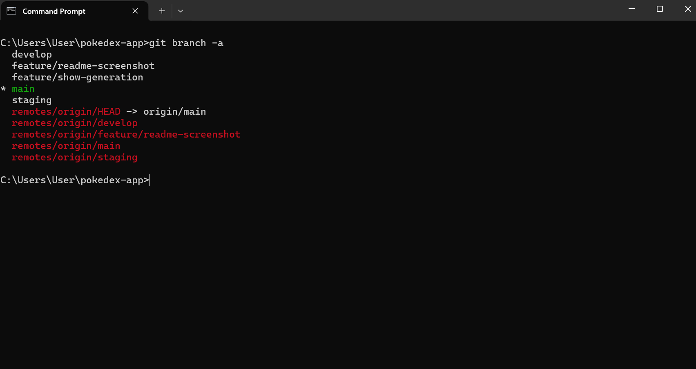
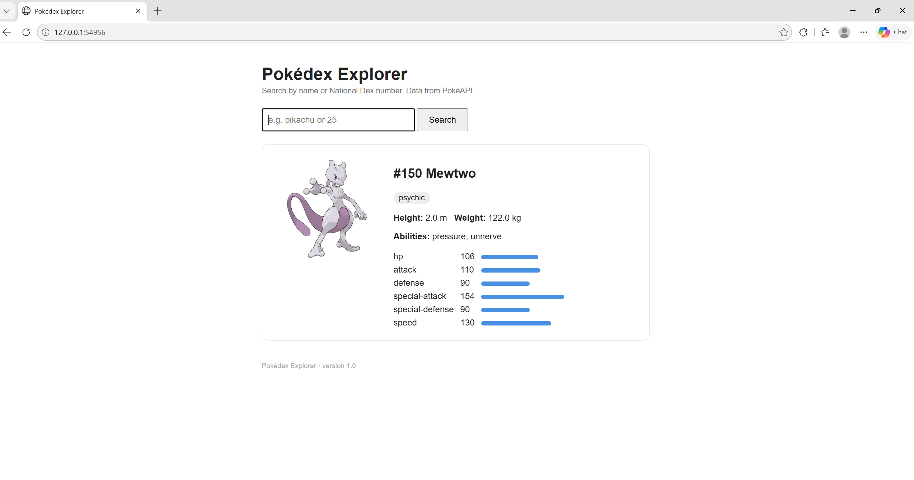

# Pokédex Explorer

A small Flask application over the public [PokéAPI](https://pokeapi.co) (no API key needed).
Search a Pokémon by name or National Dex number and see its types, abilities, base stats and artwork.

Built for the Module-1 CI/CD assignment: containerised with Docker, built and tested by a
Jenkins pipeline (`Jenkinsfile`), deployed to a local Minikube cluster (`k8s/`).

## Layout

| Path | Purpose |
|---|---|
| `app.py` | Flask app: `/` (search form), `/health` (probe endpoint) |
| `templates/index.html` | The page |
| `tests/test_app.py` | 7 tests; PokéAPI calls are mocked so they run offline |
| `Dockerfile` | python:3.12-slim image, runs `python app.py` on port 5000 |
| `Jenkinsfile` | Checkout → Build image → Test in container → Push (main) → Deploy to Minikube (main) |
| `k8s/deployment.yaml` | 2 replicas, readiness/liveness probes on `/health`, resource limits |
| `k8s/service.yaml` | NodePort 30081 → container 5000 |

## Run locally (no Docker)

    python -m venv .venv
    .venv\Scripts\activate
    pip install -r requirements.txt
    python -m pytest tests -v
    python app.py            # open http://localhost:5000

## Run in Docker

    docker build -t debray2523/pokedex-app:1.0 .
    docker run --rm debray2523/pokedex-app:1.0 python -m pytest tests -v
    docker run -d --name pokedex -p 5000:5000 debray2523/pokedex-app:1.0
    # open http://localhost:5000 ; then: docker rm -f pokedex

## Deploy to Minikube by hand (the assignment's Phase-1 path)

    minikube start --driver=docker
    minikube image load debray2523/pokedex-app:1.0
    kubectl apply -f k8s/deployment.yaml -f k8s/service.yaml
    kubectl get pods -w                       # wait for 2/2 Running, Ctrl+C
    minikube service pokedex-app-service      # opens the browser

`deployment.yaml` uses `imagePullPolicy: IfNotPresent`, so the image loaded with
`minikube image load` is used without any registry.

## Deploy through Jenkins

The Jenkinsfile builds an image tagged with the short commit hash, runs the tests inside it,
and on `main` pushes it to Docker Hub and rolls it onto the cluster with `kubectl set image`.
Jenkins needs: Docker Desktop running, a `dockerhub` username/token credential, and the
`KUBECONFIG` / `PATH+KUBE` environment variables pointing at your Minikube config and kubectl.

## Rollback

    kubectl rollout undo deployment/pokedex-app

## Git workflow (GitFlow)

Branches on origin: `main` (production), `staging` (pre-release), `develop` (integration), `feature/*` (e.g. `feature/readme-screenshot`, `feature/show-generation`).

Flow used: `feature/*` → PR into `develop` → PR `develop` → `staging` → PR `staging` → `main`.
Merged pull requests: #1 `feature/show-generation` → `develop`, #2 `feature/readme-screenshot` → `develop`, #3 `develop` → `staging`, #4 `staging` → `main`.

- Branch list: [docs/git-branches.txt](docs/git-branches.txt)
- Commit graph: [docs/git-history.txt](docs/git-history.txt)

## Application output

## Submission document

Screenshots and evidence for each rubric item: [Project1_CI_CD_Pipeline_DebendraRay.docx](docs/Project1_CI_CD_Pipeline_DebendraRay.docx)
